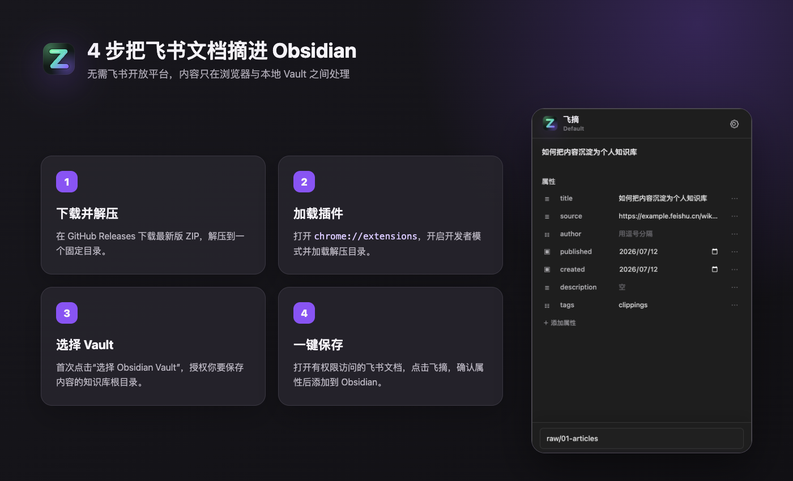
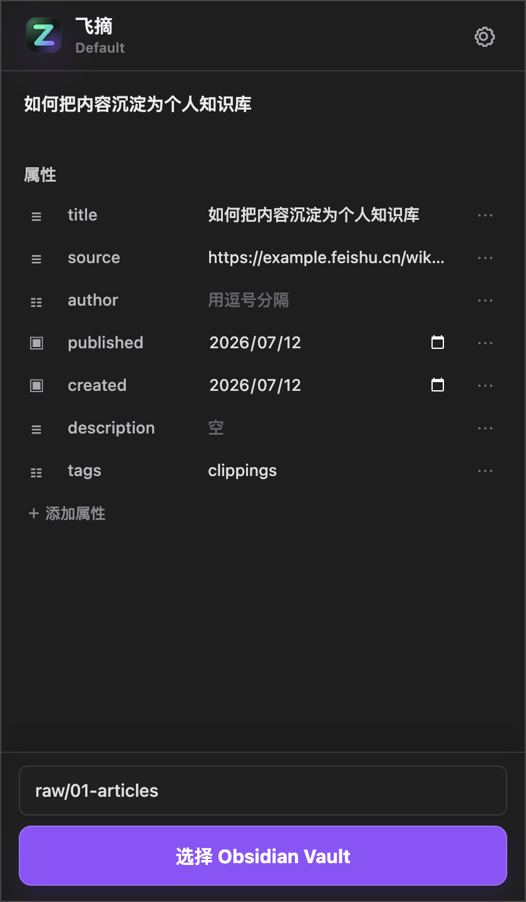

<p align="center">
  
</p>

<h1 align="center">飞摘</h1>

<p align="center"><strong>把飞书文档一键摘进 Obsidian</strong></p>

<p align="center">
  无需申请飞书开放平台 · 正文与图片一起保存 · 数据不经过第三方服务器
</p>

<p align="center">
  <a href="https://github.com/ushowjack/feishu-ob-clipper/releases/latest"><strong>下载最新版</strong></a>
  ·
  <a href="#四步开始使用">安装教程</a>
  ·
  <a href="#常见问题">常见问题</a>
</p>



## 飞摘能做什么

飞摘是一款 Chrome 插件。打开你有权限访问的飞书 Wiki 或文档，点击插件，它会把正文转换成 Markdown，并把文中的图片一起保存到你选择的 Obsidian Vault。

- 保存标题、段落、列表、任务列表、引用、代码块、表格、链接和图片。
- 保存前可以修改标题、标签、日期等 Obsidian 属性。
- 图片写入你指定的附件目录，正文自动使用 Obsidian `![[...]]` 链接。
- 遇到同名笔记或图片会自动改名，不会覆盖已有文件。
- 长文会自动滚动采集，完成后恢复原来的阅读位置。
- 所有内容只在当前浏览器与本地 Vault 之间处理。

<p align="center">
  
</p>

## 四步开始使用

### 1. 下载并解压

前往 [Releases 页面](https://github.com/ushowjack/feishu-ob-clipper/releases/latest)，下载 `feishu-ob-clipper-v*.zip`，然后解压到一个固定目录。

> Chrome 会一直从这个目录读取插件，所以安装后不要删除或随意移动它。

### 2. 加载到 Chrome

1. 在 Chrome 地址栏输入 `chrome://extensions`。
2. 打开页面右上角的“开发者模式”。
3. 点击“加载已解压的扩展程序”。
4. 选择刚才解压的目录。正确目录里可以直接看到 `manifest.json`。
5. 建议点击浏览器工具栏的拼图图标，把“飞摘”固定到工具栏。

### 3. 首次选择 Obsidian Vault

1. 在 Chrome 中登录飞书，打开一篇你有权限访问的 Wiki 或文档。
2. 等正文显示完成后，点击工具栏中的“飞摘”。
3. 点击“选择 Obsidian Vault”。
4. 在系统目录选择器里选中你的 Vault 根目录，并允许写入。

这是 Chrome 的本地目录授权。飞摘不会得到其他文件夹的权限，也不会把目录信息上传到服务器。

### 4. 保存飞书文档

1. 检查标题和属性，需要时直接修改。
2. 确认底部的笔记目录。留空会保存到 Vault 根目录，也可以填写 `raw/01-articles` 这样的相对路径。
3. 点击“添加到 Obsidian”。
4. 看到成功提示后，回到 Obsidian 即可找到笔记。

默认附件目录是 `attachments/feishu`。不存在的目录会自动创建。

## 保存后的效果

保存的笔记是普通 Markdown 文件，属性和图片都能被 Obsidian 直接识别：

```markdown
---
title: "示例飞书文档"
source: "https://example.feishu.cn/wiki/token"
created: "2026-07-12"
tags:
  - "clippings"
---

# 示例飞书文档

这里是飞书正文……

![[attachments/feishu/示例飞书文档-01.png]]
```

## 使用范围

当前支持有权限访问的飞书 `wiki`、`docx` 和 `docs` 页面。

暂不包含评论、修订历史、画板、数据库视图、电子表格和复杂第三方嵌入。遇到暂时无法下载的图片时，飞摘仍会保存正文并保留远程图片链接，同时在结果中提示失败数量。

## 常见问题

### 提示“插件尚未注入当前页面”

刚安装或更新插件后，请刷新已经打开的飞书页面再试。Chrome 不会自动把新安装的内容脚本注入旧标签页。

### 提示“没有识别到已加载的飞书正文”

确认当前账号有文档权限，并等待正文显示完成。如果刚打开的是新标签页、飞书首页或搜索结果页，请先进入具体文档。

### 保存长文时，页面为什么会自动滚动

飞书长文只渲染当前位置附近的内容。飞摘需要短暂遍历文档来收集完整正文，完成后会恢复原来的滚动位置，不会修改飞书文档。

### 再次打开 Chrome 后提示恢复 Vault 授权

这是浏览器对本地目录的安全保护。点击“恢复 Vault 授权”；如果仍然失败，进入设置并重新选择 Vault。

### 部分图片没有保存

飞书图片可能使用临时地址或已过期的签名。飞摘会尽量保存可读取的图片；失败时仍会保留正文和远程图片链接，不会让整篇笔记丢失。

### 路径填写后无法保存

这里只能填写 Vault 内的相对路径。`/绝对路径`、`C:\路径` 或包含 `..` 的越界路径会被拒绝。

## 隐私与权限

- `activeTab`：只在你点击飞摘时读取当前标签页信息。
- `storage`：在浏览器本地保存笔记目录、附件目录和属性模板。
- `https://*.feishu.cn/*`：在飞书页面读取当前已显示的文档正文。
- Vault 权限：由 Chrome 的系统目录选择器单独授权，并保存在插件自己的本地存储中。

飞摘不使用飞书开放平台 API，不接入统计服务，也不会把文档、图片或 Vault 信息发送到第三方服务器。源码完全公开，欢迎检查。

## 更新插件

下载并解压新版本，用新目录替换旧目录，然后到 `chrome://extensions` 点击“飞摘”卡片上的“重新加载”。最后刷新已经打开的飞书页面。

<details>
<summary><strong>开发、测试与发布</strong></summary>

### 从源码安装

克隆仓库后，在 `chrome://extensions` 中选择“加载已解压的扩展程序”，直接选择仓库根目录。修改代码后需要重新加载插件，并刷新飞书页面。

项目没有运行时依赖或构建步骤。使用 Node.js 20 或更高版本执行：

```bash
npm test
npm run check
npm run package
```

`npm run package` 会在 `dist/` 中生成带版本号的 Release ZIP。浏览器人工验收步骤见 [`tests/manual-checklist.md`](tests/manual-checklist.md)。

发布正式版本时，同步修改 `package.json` 与 `manifest.json` 的版本，完成验证并提交，然后创建对应标签：

```bash
git tag -a v0.1.0 -m "Release v0.1.0"
git push origin main
git push origin v0.1.0
```

GitHub Actions 会校验测试、语法、版本和压缩包结构，然后创建 Release 并上传 ZIP。

</details>

## 反馈问题

如果保存失败，欢迎在 [GitHub Issues](https://github.com/ushowjack/feishu-ob-clipper/issues) 中说明：

- 当前飞书页面类型（Wiki、文档或其他）。
- 弹窗中出现的完整错误提示。
- 是否刷新页面、重新授权 Vault 后仍能复现。

请不要上传包含隐私内容的飞书文档、截图或 Vault 文件。
